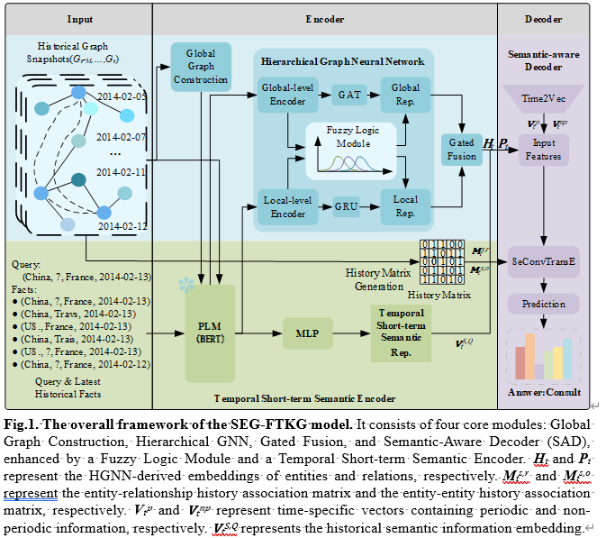

# A Semantically Enhanced Graph Neural Network for Fuzzy Temporal Knowledge Graph Reasoning with Local and Global Representations

<div style="text-align: center;">
    
</div>


## Installation
To set up the environment for SEG-FTKG, follow these steps:

Create and activate a new Conda environment named 'SEG-FTKG' with Python 3.11
```bash
conda create -n SEG-FTKG python=3.11
```

```bash
conda activate SEG-FTKG
```

Install required packages from the provided requirements file.
cd to SEG-FTKG directory
```bash
pip install -r requirements.txt
```

`torch` and `dgl` require specific matching `CUDA Version` installed on your system to ensure compatibility.

## Example

Here is an example of how to install "torch", "torchvision" and "dgl" compatible with `CUDA 12.1` under `Linux`. 

Install torch and torchvision for CUDA 12.1.
```bash
conda install pytorch==2.1.2 torchvision==0.16.2 torchaudio==2.1.2 pytorch-cuda=12.1 -c pytorch -c nvidia
```

Install dgl for CUDA 12.1.
```bash
conda install -c dglteam/label/th21_cu121 dgl
```
# 指定PyTorch版本 CUDA12.1以上 仅python3.11   numpy1.x   gpu24G
pip install torch==2.2.0 torchvision==0.17.0 torchaudio==2.2.0 --index-url https://download.pytorch.org/whl/cu121

# 指定DGL版本
pip install dgl==1.1.3+cu121 -f https://data.dgl.ai/wheels/cu121/repo.html
### Note:
- You can check your installed CUDA version by running:
  ```bash
  nvidia-smi
  ```

- You can find detailed installation instructions and download links on the following official sites:

  - [PyTorch Official Website](https://pytorch.org/)
  - [DGL Official Website](https://www.dgl.ai/pages/start.html)


## How to Run

```bash
unzip data.zip
```

### Prepare PLM
The following is an example of the file content format that needs to be configured in the `plm` folder to use PLM:

```plaintext
plm/
├── bert/
│   ├── bert-large-cased/
│   │   ├── config.json
│   │   ├── flax_model.msgpack
│   │   ├── pytorch_model.bin
│   │   ├── tokenizer_config.json
│   │   ├── tokenizer.json
│   │   ├── vocab.txt
│   └── bert-base-cased/
│       ├── config.json
│       ├── pytorch_model.bin
│       ├── vocab.txt
```


- **`plm/`**: The root directory for pre-trained language models.
- **`bert/`**: A directory for all BERT models.
  - **`bert-large-cased/`**: Contains the files for the `bert-large-cased` model.
  - **`bert-base-cased/`**: Contains the files for the `bert-base-cased` model.


Here are the links to download the PLMs used from huggingface:

- **BERT Large Cased**: [https://huggingface.co/bert-large-cased](https://huggingface.co/bert-large-cased)
- **BERT Base Cased**: [https://huggingface.co/bert-base-cased](https://huggingface.co/bert-base-cased)

### Generate data

You need to run the file `generate_data.py` to generate the graph data needed for our model:

```python generate_data.py --data=DATA_NAME```

In order to speed up training and testing, for ICEWS18, ICEWS05-15, and GDELT datasets, data in the required format can be constructed in advance before training and testing:

```python save_data.py --data=DATA_NAME```

### Training and Testing 

Then you can run the file `main.py` to train and test our model. 
The detailed commands can be found in `{dataset}.sh`. Some important hyper-parameters can be found in ```long_config.yaml```
and ```short_config.yaml```.

### Train Models

To train the SEG-FTKG models, you can use the following command, `{}` indicates optional parameters:

```bash
cd src
```

```bash
python main.py -d ICEWS18 --model-type bert --plm bert-large-cased --gpu 0 --add-static-graph --num-k 7 --history-len 11 --self-loop 
```

### Evaluate Models

To evaluate the SEG-FTKG models, add the `--test` argument to the training command. 


### Detailed Hyperparameters

The following commands and trained models can be used to replicate the entity and relation prediction results reported in the paper. Remove `--test` to train new models.

#### ICEWS14

```bash
python main.py -d ICEWS14s --model-type bert --plm bert-large-cased --gpu 0 --add-static-graph --num-k 7 --history-len 11 --self-loop 
```


#### ICEWS18

```bash
python main.py -d ICEWS18 --model-type bert --plm bert-large-cased --gpu 0 --add-static-graph --num-k 5 --history-len 14 --self-loop 
```

#### ICEWS05-15

```bash
python main.py -d ICEWS05-15 --model-type bert --plm bert-large-cased --gpu 0 --add-static-graph --num-k 5 --history-len 14 --self-loop 
```

#### GDELT

```bash
python main.py -d GDELT --model-type bert --plm bert-large-cased --gpu 0 --num-k 7 --history-len 12 --self-loop  --test 
```

## Acknowledge

Some of our code is referenced from RE-GCN: [https://github.com/Lee-zix/RE-GCN](https://github.com/Lee-zix/RE-GCN) and TiRGN:[https://github.com/Liyyy2122/TiRGN](https://github.com/Liyyy2122/TiRGN).


